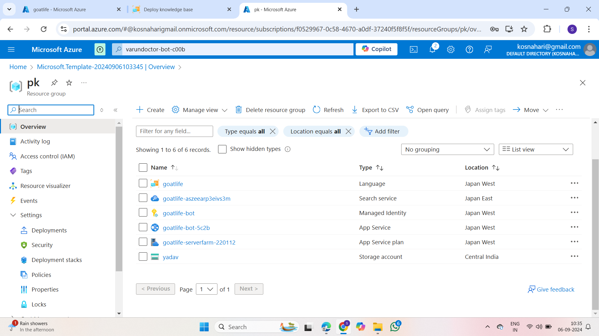
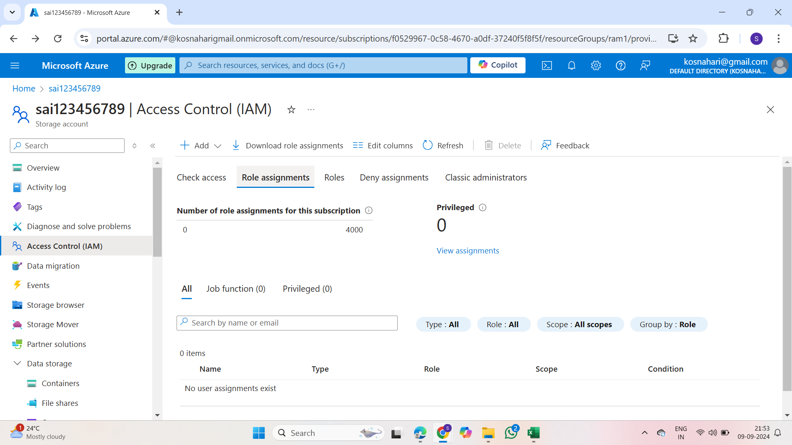
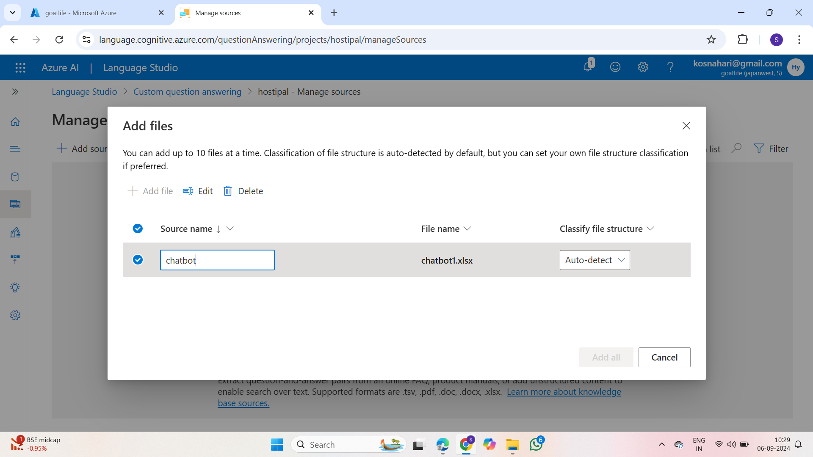
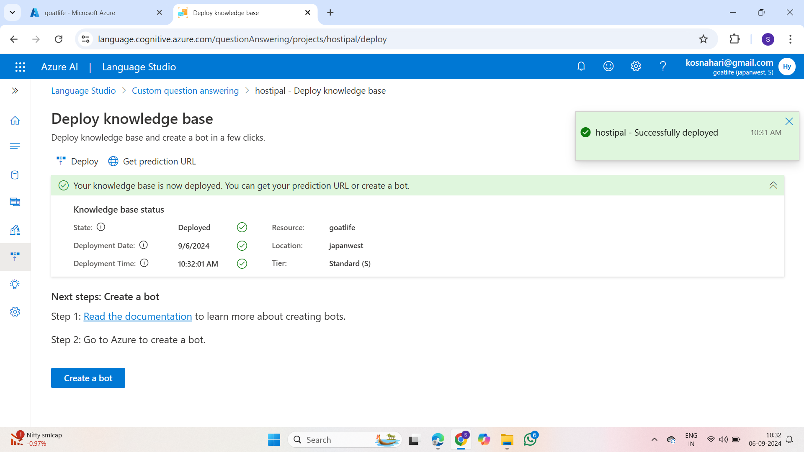
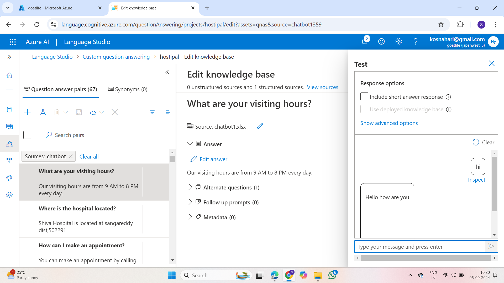
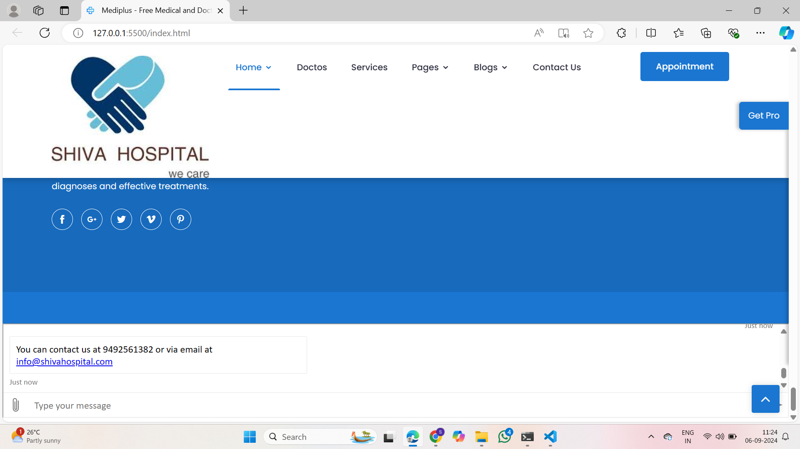

**#Deploying Staticwebsite and Creating Chatbot for it Using Azure AI Services**

#shiva Hospital

The Shiva Hospital website offers a seamless, free gateway to essential healthcare services, empowering the community with easy access to information and appointment scheduling. It combines user-friendly design with multilingual support to ensure that everyone can benefit from its resources.

# Project Details
1. Demo Video URL:https://youtu.be/ODEvHifwt3U?si=32vbp_9xIgikfGTd
2. demo website URL:https://bhai.z31.web.core.windows.net/
3. GitHub Repository URL: https://github.com/Ramaiahgarisaikiranpatil/Hospital.git
4. Industry:shiva Hospital - Healthcare
# Roles and responsibilities
1. sai kiran patil ramaiahgari (project management) :Manages the web development project.
2. sai pavan mukkapally(Deployment) :Deployment and maintenance of project infrastructure.
3. vishweshwar korivi (Images, logos and chat bot questions) :Responsible for image searching, logo creation and chat bot questions.
# Azure services used:
1. Azure blob storage
2. Storage account
3. Azure Backup service
4. Azure AI services
5. chatbot
6. Azure Role Based access Control(RBAC)
# Problem Statement:
Shiva Hospital aims to enhance community access to healthcare by developing a user-friendly, free website that provides comprehensive information about its services, staff, and facilities. The website will feature an easy-to-use appointment scheduling system, educational resources on health and wellness, and multilingual support to cater to diverse needs. Key challenges include ensuring accessibility for users with disabilities, securing patient data, integrating with existing hospital systems, and managing costs. The goal is to create a fully functional, accessible online platform that engages users effectively and supports the hospital’s mission of providing quality care to all.

# Project Description:
The Shiva Hospital website is a free, user-friendly online platform designed to provide the community with easy access to essential healthcare information and services. It features detailed descriptions of the hospital's medical services, staff profiles, and operational hours. Users can schedule, reschedule, or cancel appointments online through an intuitive system, and access educational resources on health and wellness. The website supports multiple languages and adheres to accessibility standards to ensure it meets the diverse needs of all users. Its goal is to enhance the hospital's outreach and facilitate better patient engagement while remaining completely free of charge.Additionally, the platform is designed with robust security measures to protect patient information and seamlessly integrates with existing hospital systems for streamlined operations. By offering these features at no cost, the website supports Shiva Hospital’s mission of providing high-quality, accessible healthcare to all members of the community.
# Core Azure Services:
Azure Blob Storage:- Azure Blob Storage is Microsoft's scalable object storage solution in the Azure cloud. It enables secure and cost-effective storage of unstructured data, such as documents and images. Offering seamless integration with applications, it supports data of any size and optimizes accessibility through a globally distributed network. 
Azure Storage Account:- Azure Storage Account is a foundational component in Microsoft Azure, providing secure and scalable cloud storage. It supports various storage services like Blob, File, Queue, and Table, accommodating diverse data types. With features such as redundancy options and access controls, it ensures reliable and efficient data management. 
Azure Backup Service:- Azure Backup Service by Microsoft safeguards critical data in the Azure cloud. It offers automated and scalable backup solutions for virtual machines, applications, and files. With features like long-term retention and geo-redundancy, it ensures data resilience and facilitates efficient disaster recovery, enhancing overall data protection strategies.
# Azure AI Service
Azure Chatbot :- The Azure AI Language Chatbot is a cutting-edge conversational agent powered by Microsoft's Azure platform. Leveraging advanced natural language processing capabilities, it facilitates dynamic and context-aware interactions. This intelligent chatbot employs machine learning algorithms to comprehend user queries, providing personalized responses and assistance across diverse domains. Seamlessly integrating with Azure services, it ensures scalability and reliability.

# Screenshot’s:
# Storage Account
- 

# Container

# resourcegroup

# Iam

# uploadingexcelsheet

# creatingabot

# testingchatbot

# Test in web chat

# Final Project Statement:
The Shiva Hospital website will provide a free, user-friendly platform that offers seamless access to healthcare services, appointment scheduling, and health education. Designed with multilingual support and accessibility features, it aims to serve and engage the entire community. This project embodies the hospital’s commitment to delivering compassionate, high-quality care to all.

